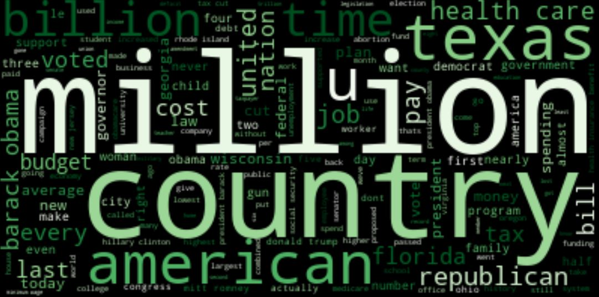

# Fake News Classification


**Author**: Marcelo Scatena

## Overview

Fake news has become increasingly more common in the past decades. It's effectiveness cannot be misjudged, as it can aid people in not taking responsability, in winning arguments or, in a bigger scale, elections. In 2016 hundreds of teenagers in Europe were hired to write false stories about the US election. Their stories would be retweeted or shared on social media or direct message hundreds and thousands of times, reaching millions of people. It's hard to quantify how much those stories could influence an outcome, but nearing the end of the election, fake news had a higher engagement count than mainstream news.<br />
Stories like this are not only recent though. One can easily look at las century history when some say [Hitler Pioneered 'Fake News'](https://www.nytimes.com/2019/10/16/opinion/hitler-speech-1919.html), but this has happened for milenia, with counts in 1274 bce, where Ramses's II accounts of [The Battle of Kadesh](https://www.ingeniahistory.com/post/the-battle-of-kadesh) have been gravely misconstruded.
***

## Business Problem

Detecting fake news is a very challenging task. If the platform where it is being broadcasted can be biased, and one simply can't have access to the source material, how can you attest to it's truthness? We also have to take into consideration that out of those fake news, some of them could have been written as parody, some completely fabricated, some manipulated or making false connections.
To better understand how to assess if a news is fake or true, I'll be using Natural Language Processing.
***

## Data

With the idea of trying to improve fake news classification, the LIAR dataset was created in 2017, containing 12.8 thousand manually labeled short statements from the last decade gathered from PolitiFact.com, which provides detailed analysis report and links to source document to each case. This is the most accuratly labeled dataset on the subject and became a benchmark for it.<br />
The data consists of 12.8k rows with 14 different features containing: Statement ID, Label, Statement, Speaker, Speaker's job title, State, Speaker's party affiliation, the statement credit count (from pants on fire to true), Venue or Location of statement and the Justification for the labeling. I'll explore all the metadata but will create my models using only the 'statement' and 'label' features, since I want to see if the models can be used in broader situations.<br />
[Link](https://github.com/Tariq60/LIAR-PLUS) to dataset.
***

## Methods & Evaluation Metrics
 
 * The dataset was made with the specific mission to improve Natural Language Processing models, so we'll use it for that.

 The first steps of preprocessing for NLP is cleaning the data. Strings have to be split and turned into lists, stop words and punctuation removed. Depending on the data more preprocessing has to be done, but given the nature of the dataset, it doesn't contains characters like '#' and '@'.

 * Metric used: Accuracy

I chose Accuracy for my main evaluation metric because what we care about most here is the overall percentage of correct predictions we make. Although false negative (classifying a statement as true when it's actually fake) cold potentially be more harmful than false positives, neither of them have a low cost and should be treated with equal importance.
***
## Results

* Models performance by accuracy


The accuracy from the models doesn't improve much from the baseline when using these machine learning models, that have been grid searched for hyper parameter tuning and paired with Count Vectorizer (CV), Term Frequency–Inverse Document Frequency Vectorizer (TF-IDF) or Hash Vectorizer (HASH), tested with just unigrams, bigrams and a combination of both.

* Confusion Matrix for best model


Interpretation of the best model

* I have ploted word clouds containing the words that appear most in true statements, and in false statements:

  


  


***

## Conclusions

Trying to contextualize human speech is not an easy feat, for humans or computers. Unlike classifying if someone is happy or sad, or a sentence belongs to a topic or another one, labeling something as true or false is much harder. There aren't absolute keywords to facilitate that classification, and though word embeddings have come a long way in contextualizing words amongst each other, they can validate or deny a sentence by themselves. I believe there is room for improvement in the classification of fake news, but without using metadata, analysing sources and using human interpretation, a model will never be perfect. What I would like to try now are different embedding techniques, including:
  - Bert
  - Elmo
  - GPT 3
With a more robust algorithm we could at least open doubt into certain news that are so easily spreadable, and make sure to perform proper due diligence when in contact with dubious information.
***
## Next Steps

* Different Languages
  - The model can be adapted to perform in different languages if there is a pre-trained model with that language vocabulary embeded. That would make it useful for different countries and media sources, and further help decrease the spread of fake news.
* Use Metadata
  - The person making the statement, their political affiliation and other characteristics may affect how the model operates. If we have that information for new statements, it could give us a more accurate classification.

## For More Information

Please review my full analysis in [my Jupyter Notebook](./Main_Notebook.ipynb) or my [presentation](./presentation.pdf).

For any additional questions, please contact<br />
Marcelo Scatena: [LinkedIn](https://uk.linkedin.com/in/marcelo-scatena) | Email: marcelo.oddo@gmail.com<br />

## Repository Structure

```
├── README.md                     
├── Main_Notebook.ipynb 
├── presentation.pdf              
├── Neural_Networks.ipynb
├── Clustering.ipynb
├── lda.ipynb
├── data                                
└── images                              
```
