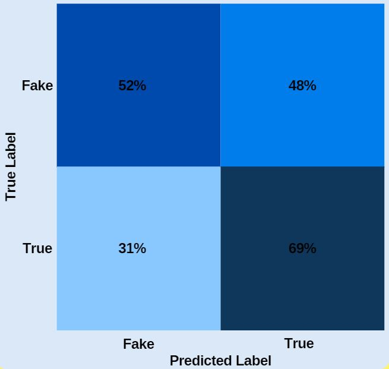

# Fake News Classification


**Author**: Marcelo Scatena

## Overview

Fake news has become increasingly more common in the past decades. It's effectiveness cannot be misjudged, as it can aid people in not taking responsability, in winning arguments or, in a bigger scale, elections. In 2016 hundreds of teenagers in Europe were hired to write false stories about the US election, creating a [fake news industry](https://www.cambridge.org/core/journals/ps-political-science-and-politics/article/macedonian-fake-news-industry-and-the-2016-us-election/79F67A4F23148D230F120A3BD7E3384F#). Their stories would be retweeted or shared on social media or direct message hundreds and thousands of times, reaching millions of people. It's hard to quantify how much those stories could influence an outcome, but nearing the end of the election, fake news had a higher engagement count than mainstream news.<br />
Stories like this are not only recent though. One can easily look at las century history when some say [Hitler Pioneered 'Fake News'](https://www.nytimes.com/2019/10/16/opinion/hitler-speech-1919.html), but this has happened for milenia, with counts in 1274 bce, where Ramses's II accounts of [The Battle of Kadesh](https://www.ingeniahistory.com/post/the-battle-of-kadesh) have been gravely misconstruded.
***

## Business Problem

Detecting fake news is a very challenging task. If the platform where it is being broadcasted can be biased, and one simply can't have access to the source material, how can you attest to it's truthness? We also have to take into consideration that out of those fake news, some of them could have been written as parody, some completely fabricated, some manipulated or making false connections.
To better understand how to assess if a news is fake or true, I'll be using Natural Language Processing.
***

## Data


With the idea of trying to improve fake news classification, the LIAR dataset was created in 2017, containing 12.8 thousand manually labeled short statements from the last decade gathered from PolitiFact.com, which provides detailed analysis report and links to source document to each case. This is the most accuratly labeled dataset on the subject and became a benchmark for it.<br />
The data consists of 12.8k rows with 14 different features containing: Statement ID, Label, Statement, Speaker, Speaker's job title, State, Speaker's party affiliation, the statement credit count (from pants on fire to true), Venue or Location of statement and the Justification for the labeling. I'll explore all the metadata but will create my models using only the 'statement' and 'label' features, since I want to see if the models can be used in broader situations.<br />
[Link](https://github.com/Tariq60/LIAR-PLUS) to dataset.
***

## Methods & Evaluation Metrics
 
 * The dataset was made with the specific mission to improve Natural Language Processing models, so we'll use it for that.

 Inside Natural Language Processing there are several ways to work with the data. In this project I'll use the following vectorizers:
  - **Count Vectorizer**: Converts documents into a sequence of words and count how often they appear in the document.
  - **Term Frequency Inverse Document Frequency**: Calculates how frequently a word appears in a document and multiplies it by the inverse of how frequently the word appears in the whole corpus.
  - **Hash Vectorizer**: Converts a collection of text documents to a matrix of token occurrences.
  I'll combine each of these with a n-gram range to try to improve results. The ranges used will be of (1,1), which accounts only for unigrams, (1,2), which accounts for both unigrams and bigrams, and (2,2), which accounts only for bigrams.

Several embedding techniques will be used as well. They are:
 - **Word2Vec**: First released in a 2013 paper entitled [Efficient Estimation of Word Representations in Vector Space](https://www.researchgate.net/publication/234131319_Efficient_Estimation_of_Word_Representations_in_Vector_Space). Word2Vec creates vectors that represent each word in a corpus. Each word can be pinpointed in a N-Dimensional space, and words that have semantic similarity with each other appear closer in that space than others.
 - **Glove**: GloVe is an unsupervised learning algorithm for obtaining vector representations for words. We can find their code, different glove sizes and the 2014 paper in which it was released in their website [Glove: Global Vectors for Word Representation](https://nlp.stanford.edu/projects/glove/).
 - **Doc2Vec**: It was introduced by Tomas Mikolov in 2014 in his paper [Distributed Representations of Sentences and Documents](https://arxiv.org/abs/1405.4053). There he presents the concept of 'Paragraph Vector'. It is similar to Word2Vec, where words are in a multidimensional space and the ones with semantic similarities are closer together, but it expands to paragraphs. In this sense, just as in Word2Vec the words 'big' and 'huge' would be closer together than 'computer', in Doc2Vec the sentences 'I love food' and 'meals are great' would be closer in space than 'my computer is big'.
- **nnlm-en-dim128**: This text embedding was based on feed-forward Neural-Net Language Models proposed in 2013 in the paper [A Neural Probabilistic Language Model](https://dl.acm.org/doi/10.5555/944919.944966). It's a token based text embedding module trained on English Google News. It takes a batch of sentences in a 1-D tensor of strings as input and transforms words or sentences in Tensorflow slices with 128 dimensions.
- **Sentence Embedding**: Sentence embedding takes one step further from word embedding and works directly with sentences. It makes vector representations of entire sentences and their semantic information. Here I'll be using Googles Universal Sentence Encoder. In their 2018 paper [Universal Sentence Encoder](https://arxiv.org/abs/1803.11175) the authors explain how they create the sentence embedding models and give instructions to implement them with Tensorflow.

 * Primary metric used: Accuracy

I chose Accuracy for my main evaluation metric because what we care about most here is the overall percentage of correct predictions we make.

 * Secondary mertic used: Precision

 In case accuracy alone is not enough to determine which model is better, I'll also look at Precision, since classifying statements as True even though they are Fake is more costly than the other way around.

***
## Results

* Simple Vectorizing models by accuracy


The accuracy from the models doesn't improve much from the baseline when using these machine learning models, that have been grid searched for hyper parameter tuning and paired with Count Vectorizer (CV), Term Frequency–Inverse Document Frequency Vectorizer (TF-IDF) or Hash Vectorizer (HASH), tested with just unigrams, bigrams and a combination of both. The best model from these is the Tuned Logistic Regression model that uses TFIDF and an n-gram range accounting for both unigrams and bigrams. It has a Test Accuracy of around 61% and Test Precision of around 60%.

* Embedding models by accuracy


The best Embedded model performed only slightly better than the Logistic Regression model. It is a Neural Network model using Universal Sentence Encoder to embed the data, and has a Test Accuracy of around 61% and a Test Precision of around 65%.

* Confusion Matrix for Universal Sentence Embedding



We notice here that the model correctly labels around 69% of the True statements, but does worse on Fake statements, labeling them correctly only 52% of the time.

* I have plotted word clouds containing the words that appear most in the whole data, and compared that with the word cloud regarding only statements labeled as True (in green) and the word cloud regarding only statements labeled as False (in red):


  

Given the nature of the dataset, it's hard to find useful patterns examining the word clouds alone. They are useful to get an understanding of what's mostly being talked about, but since the overlap is significant between all wordclouds created, not much can be gained from this.

* 2D Visualization of words


As with the word clouds, not much can be extracted from performing this, but it's a good evaluation to see if the embedding is working properly, since it does show words that appear more commonly together closer in space as well.

***

## Conclusions

Trying to contextualize human speech is not an easy feat, for humans or computers. Unlike classifying if a statement is 'positive' or 'negative', or a sentence belongs to a topic or another one, labeling something as true or false is much harder, since not only there aren't charged words like 'good' or 'bad' to help with classification, but the intent of Fake news is to decieve. It's purposely written or said with the intention of appearing to be true. Though word embeddings have come a long way in contextualizing words amongst each other, they can't validate or deny a sentence by themselves. I believe there is room for improvement in the classification of fake news, but without using metadata, analysing sources and using human interpretation, a model will never be perfect. What I would like to try now are different embedding techniques, including:
  - Bert
  - Elmo
  - GPT 3
  - InferSent
With a more robust algorithm we could at least open doubt into certain news that are so easily spreadable, and make sure to perform proper due diligence when in contact with dubious information.
***
## Next Steps

* Use Metadata
  - The person making the statement, their political affiliation and other characteristics may affect how the model operates. If we don't have that information for the new statements, it might still help the model to be more robust. If we have that information for new statements, it could give us a more accurate classification.
* Different Languages
  - The model can be adapted to perform in different languages if there is a pre-trained model with that language vocabulary embeded. That would make it useful for different countries and media sources, and further help decrease the spread of fake news.


## For More Information

Please review my full analysis in [my Jupyter Notebook](./Main_Notebook.ipynb) or my [presentation](./presentation.pdf).

For any additional questions, please contact<br />
Marcelo Scatena: [LinkedIn](https://uk.linkedin.com/in/marcelo-scatena) | Email: marcelo.oddo@gmail.com<br />


##### References:<br />
Reimche, Roman. (2018). [Comparison of the diffusion of real and fake news in social networks](https://www.researchgate.net/publication/322203544_Comparison_of_the_diffusion_of_real_and_fake_news_in_social_networks).. 10.13140/RG.2.2.35221.22243. <br />
[“Liar, Liar Pants on Fire”: A New Benchmark Dataset for Fake News Detection](https://aclanthology.org/P17-2067) (Wang, ACL 2017).<br />
[Where is Your Evidence: Improving Fact-checking by Justification Modeling](https://aclanthology.org/W18-5513) (Alhindi et al., 2018).<br />
Mikolov, Tomas & Chen, Kai & Corrado, G.s & Dean, Jeffrey. (2013). [Efficient Estimation of Word Representations in Vector Space](https://arxiv.org/abs/1301.3781). Proceedings of Workshop at ICLR. 2013. <br />
Quoc V. Le and Tomas Mikolov. 2014. [Distributed Representations of Sentences and Documents](https://arxiv.org/abs/1405.4053v2).<br />
Jeffrey Pennington, Richard Socher, and Christopher D. Manning. 2014. [GloVe: Global Vectors for Word Representation](https://nlp.stanford.edu/projects/glove/).<br />
Yoshua Bengio, Réjean Ducharme, Pascal Vincent, and Christian Janvin. 2003. [A neural probabilistic language model](https://dl.acm.org/doi/10.5555/944919.944966). J. Mach. Learn. Res. 3, null (3/1/2003), 1137–1155.<br />
Daniel Cer, Yinfei Yang, Sheng-yi Kong, Nan Hua, Nicole Limtiaco, Rhomni St. John, Noah Constant, Mario Guajardo-Céspedes, Steve Yuan, Chris Tar, Yun-Hsuan Sung, Brian Strope, Ray Kurzweil. [Universal Sentence Encoder](https://arxiv.org/abs/1803.11175). arXiv:1803.11175, 2018.

## Repository Structure

```
├── README.md                     
├── Main_Notebook.ipynb 
├── Word2Vec_Glove_Doc2Vec.ipynb
├── Keras_Embedding.ipynb
├── Google_nnlm_Embedding.ipynb
├── Sentence_Embedding.ipynb
├── presentation.pdf         
├── data                                
└── images                              
```
